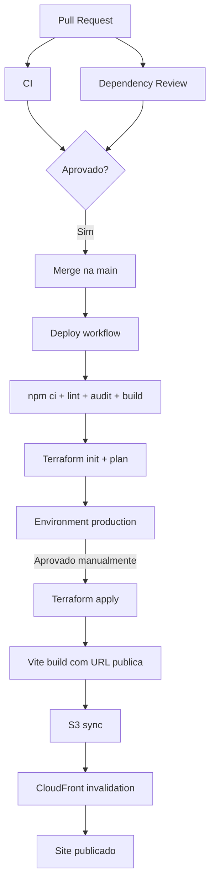

# Web Portfolio


Web portfolio construído com React, TypeScript e Vite, organizado em uma
arquitetura feature-sliced, com i18n, animações, carregamento progressivo de
seções e deploy automatizado na AWS usando Terraform + GitHub Actions.

> Este projeto foi preparado para um fluxo de entrega controlado: PR valida
> qualidade e segurança; o deploy de produção roda manualmente pelo GitHub
> Actions e exige aprovação no GitHub Environment `production`.

## Sumário

- [Visão Geral](#visão-geral)
- [Stack](#stack)
- [Estrutura do Projeto](#estrutura-do-projeto)
- [Como a Aplicação Funciona](#como-a-aplicação-funciona)
- [Rodando Localmente](#rodando-localmente)
- [Qualidade e Segurança](#qualidade-e-segurança)
- [CI/CD](#cicd)
- [Infraestrutura AWS](#infraestrutura-aws)
- [Configurando o Deploy](#configurando-o-deploy)
- [Domínio Customizado](#domínio-customizado)
- [Fluxo de Deploy](#fluxo-de-deploy)
- [Comandos Úteis](#comandos-úteis)
- [Troubleshooting](#troubleshooting)
- [Manutenção](#manutenção)

## Visão Geral

O projeto é uma SPA de portfolio com foco em performance visual, organização de
código e deploy previsível. A aplicação exibe uma página inicial composta por
hero, sobre, stack, educação, trabalhos e contato. As seções mais pesadas são
carregadas de forma progressiva para reduzir trabalho inicial no browser.

Principais características:

- React 19 com TypeScript.
- Vite para desenvolvimento e build.
- Tailwind CSS v4 para estilos globais/utilitários.
- GSAP para animações e transições.
- i18next com suporte a `en` e `pt-BR`.
- Estrutura feature-sliced para separar app, páginas, widgets, features,
  entities e shared code.
- Terraform provisionando S3 privado, CloudFront, OAC, headers de segurança e
  suporte opcional a domínio customizado.
- GitHub Actions para CI, dependency review e deploy.

## Stack

| Área        | Tecnologia                   | Papel no projeto                                      |
| ----------- | ---------------------------- | ----------------------------------------------------- |
| UI          | React 19                     | Componentização da SPA                                |
| Linguagem   | TypeScript                   | Tipagem estática e segurança de contratos             |
| Build       | Vite                         | Dev server, HMR e build de produção                   |
| Estilos     | Tailwind CSS v4 + CSS global | Layout, tokens visuais e responsividade               |
| Animação    | GSAP + `@gsap/react`         | Reveals, transições e efeitos interativos             |
| i18n        | i18next + react-i18next      | Traduções e troca de idioma                           |
| Qualidade   | ESLint + Prettier            | Lint e padronização de código                         |
| Infra       | Terraform                    | Provisionamento AWS                                   |
| Hospedagem  | S3 privado + CloudFront      | Entrega estática segura e performática                |
| CI/CD       | GitHub Actions               | Validação, plano e deploy                             |
| Auth deploy | AWS OIDC                     | Credenciais temporárias sem access key fixa no GitHub |

## Estrutura do Projeto

```txt
.
├── .github/
│   └── workflows/             # CI, dependency review, AWS connectivity, deploy e destroy
├── infra/
│   └── terraform/             # Infra AWS S3 + CloudFront
├── public/                    # Assets públicos servidos como estão
├── src/
│   ├── app/                   # Shell, providers, config e i18n base
│   ├── pages/                 # Páginas/rotas
│   ├── widgets/               # Blocos grandes da tela: hero, about, work...
│   ├── features/              # Funcionalidades reutilizáveis
│   ├── entities/              # Modelos e contratos de domínio
│   ├── shared/                # UI, libs e utilitários compartilhados
│   └── assets/                # Assets versionados no bundle
├── package.json
├── vite.config.ts
└── README.md
```

### Convenção de camadas

O projeto segue uma organização inspirada em feature-sliced design:

- `app`: composição global da aplicação.
- `pages`: páginas roteáveis.
- `widgets`: seções completas ou blocos grandes de UI.
- `features`: comportamentos específicos, como menu, intro e resume.
- `entities`: tipos e modelos centrais.
- `shared`: código compartilhado, sem dependência das camadas acima.

O ESLint reforça parte dessa arquitetura com regras de importação, bloqueando
dependências indevidas entre camadas.

## Como a Aplicação Funciona

A entrada da aplicação fica em `src/main.tsx`. A home renderiza o hero primeiro
e, quando a transição inicial libera o conteúdo, monta as demais seções com
`React.lazy`, `Suspense` e `ProgressiveSection`.

Fluxo simplificado:

```txt
main.tsx
  -> AppProviders
  -> App
  -> HomePage
  -> HeroSection
  -> ProgressiveSection + lazy widgets
```

Pontos importantes:

- O conteúdo principal da home está em `src/pages/home/ui/HomePage.tsx`.
- Os links sociais ficam em `src/app/config/profile.ts`.
- Os módulos de tradução são registrados em `src/app/config/resources.ts`.
- Os arquivos de idioma ficam distribuídos por módulo em `i18n/en.json` e
  `i18n/pt-BR.json`.
- Os PDFs de currículo ficam em `src/features/resume/assets/`.
- O build final é gerado em `dist/`.

## Rodando Localmente

### Pré-requisitos

- Node.js 24.
- npm.
- Terraform 1.15 ou superior, apenas para validação/infra.

### Instalação

```bash
npm ci
```

### Desenvolvimento

```bash
npm run dev
```

O Vite sobe um servidor local com HMR. Normalmente ele fica disponível em:

```txt
http://localhost:5173
```

### Build de produção

```bash
npm run build
```

Esse comando executa:

```bash
tsc -b && vite build
```

Ou seja: typecheck do TypeScript e build otimizado da aplicação.

### Preview do build

```bash
npm run preview
```

### Lint

```bash
npm run lint
```

## Qualidade e Segurança

A pipeline foi configurada para reprovar quando algo importante estiver errado.

| Gate                               | Bloqueia? | Onde roda             |
| ---------------------------------- | --------- | --------------------- |
| `npm ci`                           | Sim       | CI e Deploy           |
| `npm run lint`                     | Sim       | CI e Deploy           |
| `npm run build`                    | Sim       | CI e Deploy           |
| `npm audit --audit-level=moderate` | Sim       | CI e Deploy           |
| `npm outdated`                     | Não       | CI, como aviso/resumo |
| `terraform fmt -check`             | Sim       | CI                    |
| `tflint --init` + `tflint`         | Sim       | CI                    |
| Trivy IaC scan                     | Sim       | CI                    |
| `npm run infra:validate`           | Sim       | CI                    |
| `terraform plan`                   | Sim       | CI e Deploy           |
| Dependency Review                  | Sim       | PRs                   |

Importante: versões novas de libs não bloqueiam a pipeline automaticamente. Elas
aparecem como aviso via `npm outdated`. O bloqueio acontece por vulnerabilidade,
erro de lint, erro de build/typecheck ou erro de Terraform.

## CI/CD

Os workflows ficam em `.github/workflows/`.

### `CI`

Arquivo: `.github/workflows/ci.yml`

Roda em:

- Pull requests.
- Pushes na branch `main`.

Jobs:

- `App quality gates`
  - instala dependências com `npm ci`;
  - roda lint;
  - roda audit de segurança;
  - roda build;
  - publica um resumo com dependências desatualizadas, sem bloquear.
- `Terraform validation`
  - instala Terraform;
  - valida formatação dos arquivos `.tf`;
  - roda TFLint;
  - roda Trivy IaC scan para severidades `HIGH` e `CRITICAL`;
  - valida a configuração necessária para AWS;
  - assume a role AWS via OIDC;
  - inicializa o backend remoto S3;
  - valida a configuração Terraform;
  - gera um plan especulativo e publica o resumo.

Em pull requests de forks, os steps que dependem de secrets do repositório são
ignorados pelo workflow.

### `Dependency Review`

Arquivo: `.github/workflows/dependency-review.yml`

Roda em PRs e bloqueia mudanças que introduzam dependências vulneráveis com
severidade `moderate` ou superior.

### `AWS Connectivity`

Arquivo: `.github/workflows/aws-connectivity.yml`

Roda por execução manual com `workflow_dispatch`.

O workflow valida:

- configuração obrigatória de AWS e backend Terraform;
- autenticação AWS via OIDC usando `AWS_PLAN_ROLE_ARN`;
- identidade retornada por AWS STS;
- acesso ao bucket remoto de state;
- inicialização do backend remoto quando o input `terraform_init` está ativo.

### `Deploy`

Arquivo: `.github/workflows/deploy.yml`

Roda em:

- Execução manual por `workflow_dispatch`.

O deploy tem dois jobs:

1. `Terraform plan`
   - valida app;
   - assume a role AWS via OIDC;
   - inicializa backend S3;
   - gera `terraform plan`;
   - salva o plano como artifact.
2. `Terraform apply`
   - depende do plan;
   - exige aprovação no GitHub Environment `production`;
   - baixa o artifact do plano;
   - executa `terraform apply`;
   - lê outputs do Terraform;
   - gera o build com a URL pública;
   - publica `dist/` no S3;
   - cria invalidação no CloudFront.

### `Destroy`

Arquivo: `.github/workflows/destroy.yml`

Roda por execução manual com `workflow_dispatch` e só continua quando:

- `github.actor` é `PauloCSantos`;
- o input de confirmação é exatamente `destroy web-portfolio prod`;
- o GitHub Environment `production` aprova a execução.

O workflow assume `AWS_DEPLOY_ROLE_ARN`, inicializa o backend remoto, esvazia o
bucket versionado do site e executa `terraform destroy`.

## Infraestrutura AWS

A infraestrutura fica em `infra/terraform` e provisiona:

- Bucket S3 privado para os arquivos do site.
- Bloqueio de acesso público no bucket.
- Versionamento no bucket.
- Criptografia server-side AES256.
- CloudFront Distribution.
- Origin Access Control para o CloudFront acessar o S3 de forma privada.
- Headers de segurança no CloudFront.
- Fallback SPA para `403` e `404` apontando para `/index.html`.
- Domínio customizado opcional com Route53 e ACM.

### State remoto

O Terraform usa backend S3 com lock nativo:

```hcl
backend "s3" {
  encrypt      = true
  use_lockfile = true
}
```

O bucket de state é separado do bucket do site e precisa existir antes do
primeiro deploy.

## Configurando o Deploy

### 1. Criar bucket de state

Crie um bucket S3 dedicado para o state do Terraform, com versionamento ligado.
Exemplo de nomes:

```txt
web-portfolio-terraform-state
github-actions/prod/terraform.tfstate
```

O bucket de state não é o mesmo bucket que hospeda o site.

### 2. Criar role AWS para GitHub OIDC

A pipeline usa OIDC. Isso evita guardar access keys fixas no GitHub.

A trust policy da role deve permitir que o repositório assuma a role via GitHub
Actions. O formato geral é:

```json
{
  "Version": "2012-10-17",
  "Statement": [
    {
      "Effect": "Allow",
      "Principal": {
        "Federated": "arn:aws:iam::<ACCOUNT_ID>:oidc-provider/token.actions.githubusercontent.com"
      },
      "Action": "sts:AssumeRoleWithWebIdentity",
      "Condition": {
        "StringEquals": {
          "token.actions.githubusercontent.com:aud": "sts.amazonaws.com"
        },
        "StringLike": {
          "token.actions.githubusercontent.com:sub": "repo:<OWNER>/<REPO>:*"
        }
      }
    }
  ]
}
```

Troque:

- `<ACCOUNT_ID>` pelo ID da conta AWS.
- `<OWNER>/<REPO>` pelo dono e nome do repositório no GitHub.

### 3. Permissões da role

A role precisa conseguir trabalhar com:

- S3 do state.
- S3 do site.
- CloudFront.
- IAM policy document/bucket policy.
- ACM em `us-east-1`, se domínio customizado estiver habilitado.
- Route53, se domínio customizado estiver habilitado.

Para produção real, prefira uma policy mínima para os recursos do projeto.

### 4. Configurar GitHub Secrets e Variables

Em `Settings -> Secrets and variables -> Actions`, configure no escopo do
repositório ou da organização. O job `Terraform plan` usa esses valores antes da
aprovação do Environment `production`.

#### Secrets

| Nome                         | Obrigatório | Descrição                                           |
| ---------------------------- | ----------- | --------------------------------------------------- |
| `AWS_PLAN_ROLE_ARN`          | Sim         | ARN da role OIDC usada por CI e `terraform plan`    |
| `AWS_DEPLOY_ROLE_ARN`        | Sim         | ARN da role OIDC usada pelo `apply` em `production` |
| `TF_VAR_ACM_CERTIFICATE_ARN` | Não         | ARN de certificado ACM existente, se usar           |

#### Variables

| Nome                            | Obrigatório | Exemplo                                |
| ------------------------------- | ----------- | -------------------------------------- |
| `AWS_REGION`                    | Sim         | `us-east-1`                            |
| `TF_STATE_BUCKET`               | Sim         | `<state-bucket>`                       |
| `TF_STATE_KEY`                  | Sim         | `github-actions/.../terraform.tfstate` |
| `TF_STATE_REGION`               | Sim         | `us-east-1`                            |
| `TF_VAR_PROJECT_NAME`           | Sim         | `web-portfolio`                        |
| `TF_VAR_SITE_BUCKET_NAME`       | Não         | `my-portfolio-prod-site`               |
| `TF_VAR_ENABLE_CUSTOM_DOMAIN`   | Não         | `true` ou `false`                      |
| `TF_VAR_DOMAIN_NAME`            | Não         | `example.com`                          |
| `TF_VAR_HOSTED_ZONE_ID`         | Não         | vazio ou `ZXXXXXXXXXXXXX`              |
| `TF_VAR_CREATE_ACM_CERTIFICATE` | Não         | `true` ou `false`                      |

### 5. Criar o Environment `production`

Em `Settings -> Environments`, crie um environment chamado exatamente:

```txt
production
```

Configure reviewers obrigatórios. O job `Terraform apply` só roda depois dessa
aprovação.

## Domínio Customizado

O domínio é configurado por variables/secrets do GitHub.

### Domínio comprado no Route53

Se o domínio foi comprado no Route53, normalmente a Hosted Zone já fica pronta
na AWS. Você pode informar o ID dela ou deixar vazio para o Terraform criar uma
nova public hosted zone:

```txt
TF_VAR_ENABLE_CUSTOM_DOMAIN=true
TF_VAR_DOMAIN_NAME=example.com
TF_VAR_HOSTED_ZONE_ID=
TF_VAR_CREATE_ACM_CERTIFICATE=true
```

### Domínio comprado fora da AWS

Se o domínio foi comprado em outro registrador:

1. Deixe `TF_VAR_HOSTED_ZONE_ID` vazio para o Terraform criar a Hosted Zone, ou informe o ID de uma zone existente.
2. Copie os nameservers da Hosted Zone pelo output `route53_name_servers`.
3. Configure esses nameservers no painel do registrador.
4. Configure as variables no GitHub.
5. Rode o workflow `Deploy`.

Com `TF_VAR_CREATE_ACM_CERTIFICATE=true`, o Terraform cria o certificado ACM em
`us-east-1` e cria os registros DNS de validação no Route53.

### Usando certificado existente

Se você já tem um certificado ACM válido em `us-east-1`:

```txt
TF_VAR_ENABLE_CUSTOM_DOMAIN=true
TF_VAR_DOMAIN_NAME=example.com
TF_VAR_HOSTED_ZONE_ID=
TF_VAR_CREATE_ACM_CERTIFICATE=false
```

E configure o secret:

```txt
TF_VAR_ACM_CERTIFICATE_ARN=arn:aws:acm:us-east-1:...:certificate/...
```

## Fluxo de Deploy



## Comandos Úteis

| Comando                  | Descrição                                    |
| ------------------------ | -------------------------------------------- |
| `npm run dev`            | Sobe o servidor Vite com HMR                 |
| `npm run build`          | Typecheck + build de produção                |
| `npm run preview`        | Serve localmente o build em `dist`           |
| `npm run lint`           | Roda ESLint                                  |
| `npm run format`         | Formata arquivos com Prettier                |
| `npm run format:check`   | Verifica formatação com Prettier             |
| `npm run infra:fmt`      | Formata Terraform                            |
| `npm run infra:validate` | Valida Terraform após `terraform init`       |
| `npm run infra:plan`     | Gera plano Terraform                         |
| `npm run infra:apply`    | Aplica Terraform com credenciais do ambiente |
| `npm run deploy:aws`     | Aplica Terraform com credenciais do ambiente |

## Troubleshooting

### `npm audit` falhou

A pipeline bloqueia vulnerabilidades `moderate` ou superiores. Atualize as
dependências afetadas ou avalie uma substituição quando o advisory não tiver
fix disponível.

### `npm outdated` mostrou pacotes antigos

Isso não bloqueia a pipeline. É apenas um aviso para manutenção manual.

### Deploy parou aguardando aprovação

Esse é o comportamento esperado. O job `Terraform apply` usa o environment
`production` e exige aprovação manual.

### Terraform não conseguiu inicializar o backend

Verifique:

- `TF_STATE_BUCKET`.
- `TF_STATE_KEY`.
- `TF_STATE_REGION`.
- Se o bucket de state existe.
- Se a role OIDC tem permissão no bucket de state.

### Erro de credenciais AWS no GitHub Actions

Verifique:

- Secrets `AWS_PLAN_ROLE_ARN` e `AWS_DEPLOY_ROLE_ARN`.
- Trust policy das roles.
- Provider OIDC `token.actions.githubusercontent.com` na conta AWS.
- Permissão `id-token: write` no workflow.

### Site antigo depois do deploy

O deploy cria invalidation `/*` no CloudFront. Se ainda assim o conteúdo parecer
antigo, confira se o deploy terminou com sucesso e se você está acessando a
distribuição/domínio correto.

### Domínio não aponta para o site

Verifique:

- Se os nameservers do registrador apontam para o Route53.
- Se `TF_VAR_HOSTED_ZONE_ID` é da Hosted Zone correta.
- Se o certificado ACM foi emitido em `us-east-1`.
- Se o DNS já propagou.

## Manutenção

- PRs devem passar por CI antes de merge.
- Deploy em produção deve passar pela aprovação do environment `production`.
- Configurações de deploy ficam em GitHub Variables/Secrets e em variáveis de
  ambiente para execuções locais controladas.

## Referências Internas

- Infraestrutura: [`infra/terraform/README.md`](infra/terraform/README.md)
- Workflows: [`.github/workflows`](.github/workflows)
- Configuração de perfil/social: [`src/app/config/profile.ts`](src/app/config/profile.ts)
- Recursos de i18n: [`src/app/config/resources.ts`](src/app/config/resources.ts)
